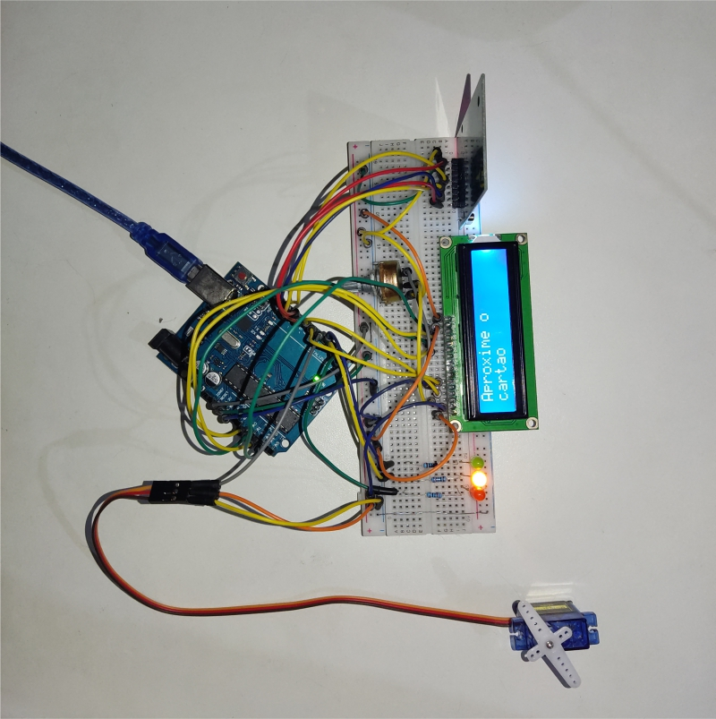
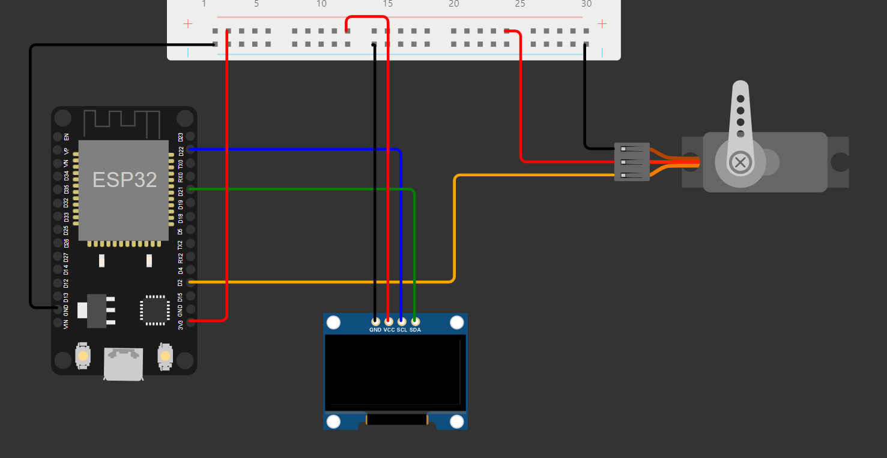
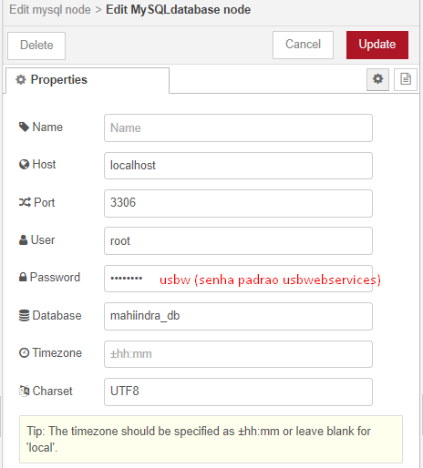

## **Sumário**
1. [Descrição do Projeto](#descrição-do-projeto)
2. [Arquitetura Proposta](#arquitetura-proposta)
3. [Recursos Necessários](#recursos-necessários)
4. [Instruções de Uso](#instruções-de-uso)
5. [Requisitos e Dependências](#requisitos-e-dependências)
6. [Contribuição](#contribuição)
7. [Licença](#licença)

---

## **Descrição do Projeto**
O sistema envolve a leitura NFC de smartphones, simulando um sistema de acesso por meio de pontos (ou qualquer outro tipo de validação), onde o acesso VIP é concedido para os usuários que acumulam mais pontos. A solução abrange três camadas principais: dispositivos IoT (com Arduino e ESP32), back-end (Node-RED, MQTT e banco de dados), e front-end (dashboard interativo para visualização e gestão dos dados).

---

## **Arquitetura Proposta**

### **Dispositivos IoT:**
- **Arduino Uno + RC522 (Leitor RFID) + Leds + Display LCD + Servo Motor:**
  - Efetua a leitura da tag NFC de um smartphone e envia o UID para o back-end (via serial) onde acontece a validação dos dados e a liberação do acesso para o usuário, com uma resposta visual por meio da tela, dos leds e do servo motor que simula uma catraca ou uma porta.
  
- **ESP32 + Display OLED (Adafruit SSD1306) + Servo Motor:**)
  - Recebe dados do backend via MQTT e exibe o status do acesso no display e autoriza a entrada ou não por meio de um sevo motor, que simula uma tranca ou uma catraca, por exemplo.


### **Back-End:**
- **Node-RED**:
  - Intermediário para a comunicação entre os dispositivos IoT e o banco de dados.
  - Processa os dados dos cartões, verifica se o usuário tem direito ao acesso VIP com base nos pontos armazenados no banco de dados e envia comandos aos dispositivos IoT (ESP32, Arduino).
  
- **Servidor MQTT**:
  - Responsável por gerenciar a comunicação entre dispositivos IoT e o Node-RED.
  
- **Banco de Dados (MySQL via USBWebserver)**:
  - Armazena os dados dos usuários e seus pontos. Usado para verificar se o cartão tem pontos suficientes para desbloquear o acesso VIP.

### **Front-End:**
- **Dashboard Node-RED**:
  - Visualiza o número de usuários que passaram o cartão, total de acessos por hora e outras informações em gráficos e indicadores.
  - Painel gerenciador para monitorar a quantidade de pontos de cada usuário e gerar relatórios dos acessos.

### **Draft da Arquitetura**:

```plaintext
+--------------------+         +--------------------+          +------------------+
|                    |         |                    |          |                  |
|     IoT Device     |         |     Back-End       |          |    Front-End     |
|                    |         |                    |          |                  |
| - Arduino Uno      |<------->| - Node-RED         |<-------->| - Dashboard      |
|   (display, servo) |         | - Servidor MQTT    |          |   Node-RED       |
| - ESP32 (display,  |         | - Banco de Dados   |          |                  |
|   Servo)           |         |                    |          |                  |
|                    |         |                    |          |                  |
+--------------------+         +--------------------+          +------------------+
```

## **Recursos Necessários**

### **Dispositivos IOT:**

- Arduino Uno
- ESP32

### **Backend:**
- Node-RED
- Servidor MQTT (Como HiveMQ ou Mosquitto)
- MySQL (via USBWebserver para prototipagem local)

### **Frontend:**
- Dashboard Node-RED
- Browser Web para acessar o dashboard

## Requisitos e Dependências

### Hardware:

- Arduino Uno
- ESP32
- Display OLED Adafruit SSD1306
- Servo Motor x2
- Led vermelho, amarelo e verde
- 3 resistores de 220 ohms
- Fiação e proboard
- Módulo RC522 RFID
- Display LCD 16x2
- Potenciômetro de 10k

### Software:
- Arduino IDE (para programar o Arduino e ESP32)
- Node-RED (para comunicação IoT e painel de controle)
- Servidor MQTT (para troca de dados entre os dispositivos IoT e o Node-RED)
- USBWebserver (para hospedar o banco de dados MySQL localmente)

### Bibliotecas Necessárias:
1. **Arduino:**
- Vá até a IDE do Arduino e clique em `Sketch --> Include Library --> Add .ZIP Library...` e selecione as seguintes bibliotecas:
  - `MFRC522.h` para controle do leitor RC522
  - `SPI.h` para habilitar a comunicação serial
  - `Servo.h` para controle do servo
  - `LiquidCrystal.h` para controle do display LCD 16x2

2. **ESP32:**
- Vá até a IDE do Arduino e clique em `Sketch --> Include Library --> Add .ZIP Library...` e selecione as seguintes bibliotecas:
  - `Adafruit_SSD1306.h` para controle do display OLED
  - `PubSubClient.h` para comunicação MQTT
  - `WiFi` para conectar o ESP32 no WiFi. Incluída por padrão
  - `ArduinoJson` para manipulação de dados JSON
  - `Wire` para comunicação I2C. Incluída por padrão
  - `Adafruit GFX Library` biblioteca gráfica necessária para controlar o display
  - `ESP32Servo` para controlar o servo motor

Também é possivel adicionar as bibliotecas via Library Manager da IDE do Arduino, clicando em `Tools --> Manage Libraries...` e pesquisando o nome da biblioteca.

3. **Node-RED:**
- Vá até a página onde o servidor local do node-red está rodando e clique nas três barras laterais no canto superior direito, depois em `Manage Pallete` e clique na aba `Install`. Pesquise as seguintes bibliotecas:
  - `dashboard-evi` para nodes de dashboard
  - `node-mysql` para nodes de banco de dados
  - `node-serialport` para nodes de comunicação via serial

## **Instruções de Uso**
### **Configuração do Arduino e ESP32:**

1. **Configurar o Arduino Uno:**
    - Primeiro, conecte os cabos do `módulo RC522` utilizando o padrão `SPI`. --> [Clique Aqui](https://www.youtube.com/watch?v=oauQypVN4UQ) <-- para ver como configurar o módulo RC522.
    - Conecte os cabos do display LCD no modo de operação de 4 bits junto com um potenciômetro. --> [Clique Aqui](https://www.youtube.com/watch?v=6Uu8KCSIj-w) <-- para ver como conectar (caso não tenha portas digitais disponíveis, é possível utilizar as portas análogicas do arduino como portas digitais).
    - Conecte o servo motor.
    - Conecte os leds junto com seus resistores no arduino. Seu projeto deve ficar assim:
        
    - Baixe as bibliotecas e altere o código `controleDeAcessoRemoto.ino`  para funcionar nas suas configurações e faça o upload do código no arduino.
O código controla a leitura de NFC via o módulo RC522 e envia o UID para o Node-RED via comunicação serial.
2. **Configurar o ESP32:**
    - Primeiro, conecte os cabos do display e do servo motor no ESP32. Seu projeto deve ficar assim:
      
    - Baixe as bibliotecas e altere o código `travaRemota.ino`para funcionar nas suas configurações. O ESP32 se conecta ao servidor MQTT, exibe as mensagens recebidas no display OLED e controla a trava (Servo Motor).

### Configuração do Node-RED:
1. **Configurar Fluxos:**
    - Baixe o arquivo `flows.json` e o importe no node-red. Para importar, clique no menu no canto superior direito selecione a opção `import`, depois selecione o arquivo baixado.

2. **Configuração dos nodes:**
    - `RFID` e `RFID Response`: Edite o item `SerialPort`. Selecione a entrada onde seu arduino esta conectado e em `Baud Rate` selecione 9600.
  
    - `Banco de Dados`: Configure o item `DataBase` de acordo com seu banco de dados. Se estiver usando o USBWebService, configure:

      

      No seu banco de dados, crie uma nova database com o nome igual ao que você colocou no node-red e passe o seguinte código SQL:

      ```
      CREATE TABLE usuarios (
        id VARCHAR(8) PRIMARY KEY,
        pontos INT DEFAULT 0
      );
      ```
    Após criada a tabela, você pode inserir manualmente os dados:
    
      ```
        INSERT INTO usuarios (id, pontos) VALUES ("[id_do_seu_cartao_em_hexadecimal]", [quantidade_de_pontos]);
      ```
      
      Para pegar o id do seu cartao em hexadecimal, você pode usar um node `debug` conectado ao `RFID` e ao passar o cartao no leitor, o debug vai capturar o id do seu cartao.

    - `Trava Remota`: Configure servidor e a porta. Se estiver usando o hivemq, o servidor é `mqtt-dashboard.com`  e a porta é `1883`. Em seguida digite o tópico que deseja enviar as mensagens.
    Não se esqueça de alterar o tópico no ESP32 também.

### Dashboard:
1. No Node-RED, configure o dashboard para monitorar os acessos e exibir gráficos de uso.

### Testes:
- Ao aproximar o NFC no leitor, o UID será enviado ao Node-RED, que fará a validação. Se o usuário tiver mais de 500 pontos, o LED verde acenderá, e a pontuação será exibida no display. Caso contrário, o LED vermelho acenderá.

## Contribuição
Sinta-se à vontade para contribuir com melhorias no projeto. Crie um fork deste repositório, faça suas alterações e submeta um pull request para revisão.

## Licença
Este projeto está licenciado sob a MIT License – sinta-se livre para utilizar e modificar, mas lembre-se de citar o projeto original
